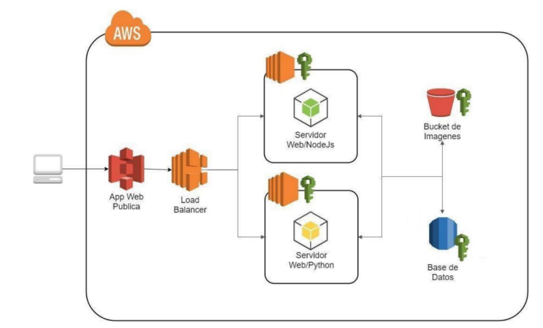
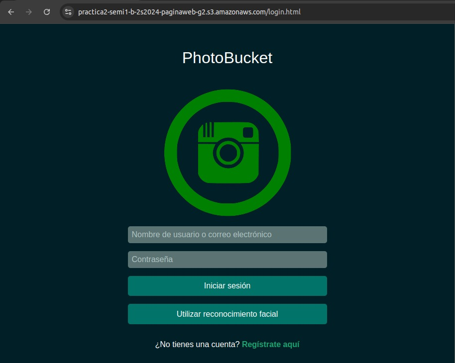
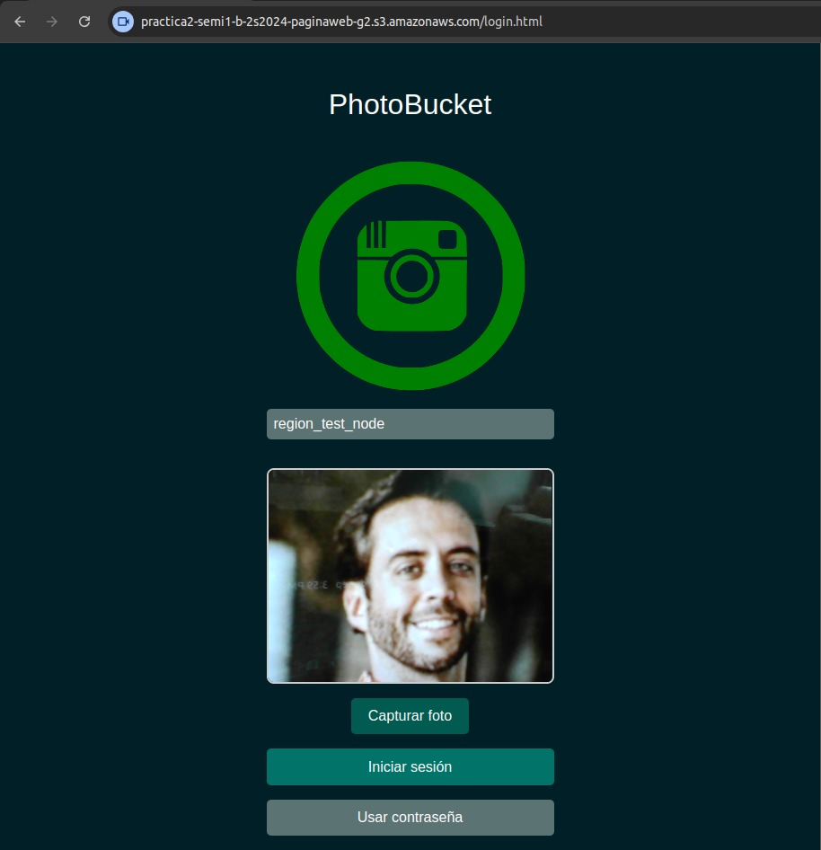
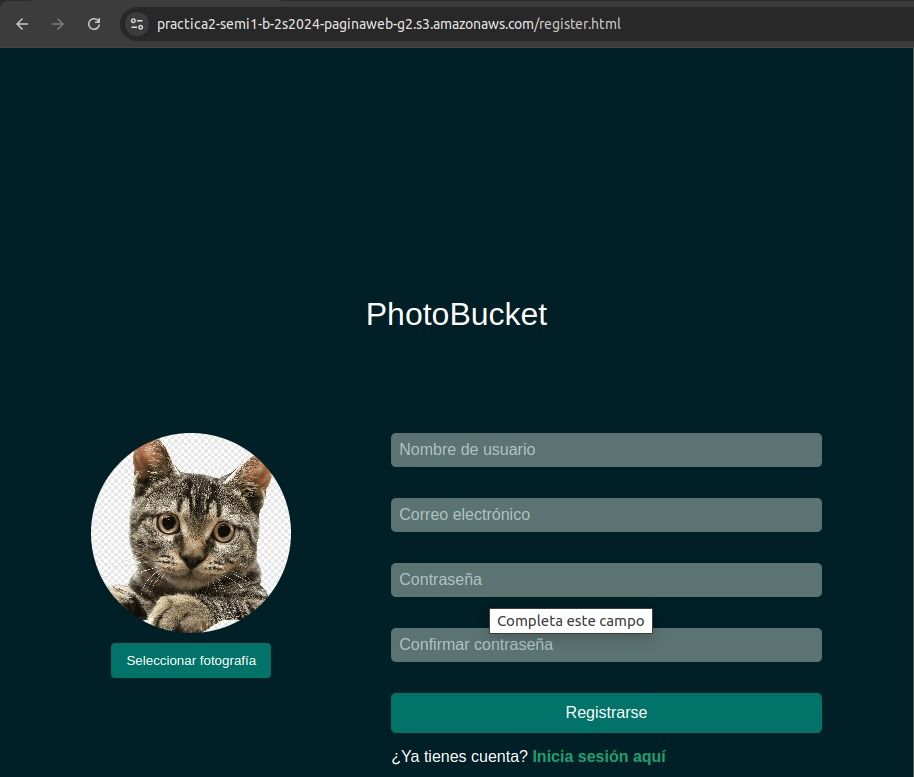
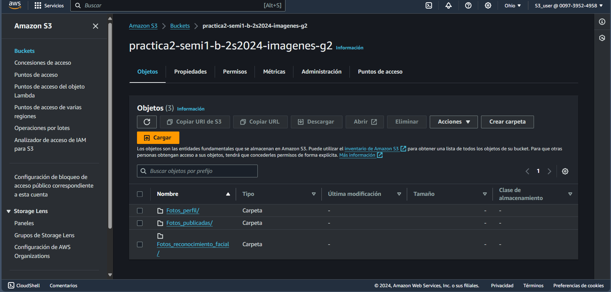
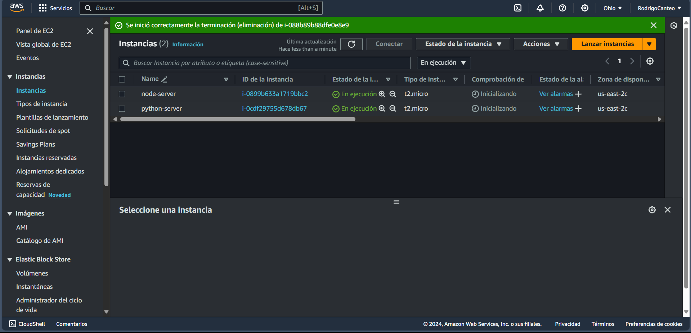
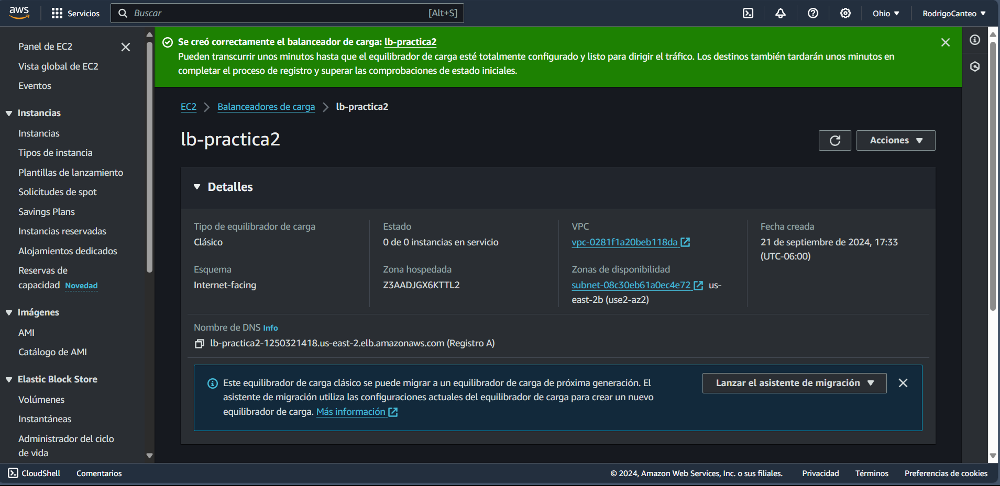
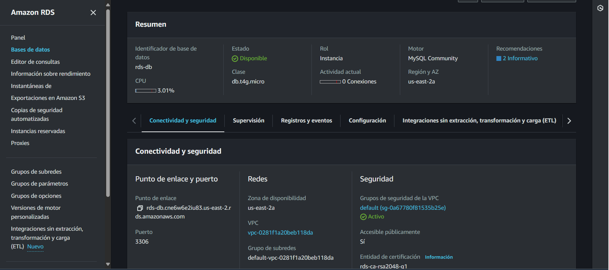

# Manual Tecnico

## Integrantes

| Carnet     | Nombre                                     |
|------------|--------------------------------------------|
| 201902363  | Christopher Iván Monterroso Alegria        |
| 201902219  | Max Rodrigo Durán Canteo                   |
| 200819244  | Edwin Estuardo Ruíz                        |
| 201906562  | Henry Mariano Ambrocio Terraza Perez       |

## Arquitectura

* **Captura:**
     * 

* **S3 (Simple Storage Service):**
  * **Bucket 1:** Alojamiento del sitio web estático.
  * **Bucket 2:** Almacenamiento de archivos multimedia.
* **EC2 (Elastic Compute Cloud):**
  * **Instancias:** Dos instancias configuradas para ejecutar servidores que manejan las solicitudes de la aplicación.
  * **Lenguaje:** Servidores implementados en Node.js y Python.
* **Load Balancer:**
  * **Balanceador de carga:** Distribuye el tráfico entre las dos instancias de EC2, asegurando alta disponibilidad y manejo eficiente de las solicitudes.
* **RDS (Relational Database Service):**
  * **Base de datos:** Almacena la información de usuarios, albumnes e imagenes.
* **Rekognition:**
  * **Translate:** 
  * **Comprehend:**
* **IAM (Identity and Access Management):**
  * **Usuarios y roles:** Gestión de permisos y acceso a los diferentes servicios de AWS.

## Descripción de Usuarios

Para garantizar un acceso seguro y segmentado a los servicios de AWS, se crearon usuarios específicos en IAM, cada uno con permisos limitados a un servicio particular:

* **S3\_user:**
  * **Política:** Acceso completo a los buckets de S3 relacionados con la aplicación.
  * **Acciones:** Gestión de archivos y configuración de los buckets.
* **EC2\_user:**
  * **Política:** Permisos para gestionar instancias de EC2, incluyendo la creación, modificación, y monitoreo de las mismas.
  * **Acciones:** Despliegue y mantenimiento de las instancias EC2 que ejecutan los servidores de la aplicación.
* **RDS\_user:**
  * **Política:** Permisos para gestionar la instancia de RDS, incluyendo la administración de la base de datos, ajustes de rendimiento y backups.
  * **Acciones:** Gestión y administración de la base de datos relacional que almacena la información de usuarios, albumnes e imagenes.
* **LoadBalancer\_user:**
  * **Política:** Permisos para configurar y gestionar el balanceador de carga.
  * **Acciones:** Configuración del balanceador de carga para distribuir el tráfico entre las instancias de EC2 y monitoreo del estado del balanceador.

## Recursos

### **S3 (Simple Storage Service):**

1. **Bucket para el Sitio Web Estático:**
   * **Captura:**
     * 
   * **Captura:**
     * 
   * **Captura:**
     * 

2. **Bucket almacenamiento multimedia:**
     * **Captura:**
     * 
### **EC2 (Elastic Compute Cloud):**

1. **Instancias de EC2:**
   * **Captura:**
     * 
### **Load Balancer:**
   * **Captura:**
     * 

### **RDS (Relational Database Service):**

1. **Instancia de RDS:**
   * **Captura:**
     * 

